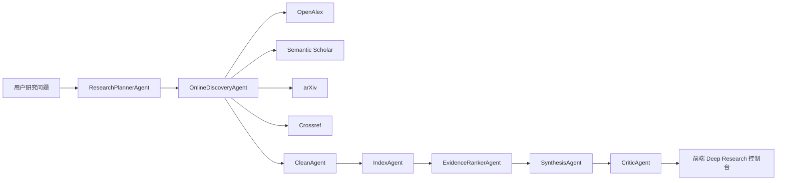

# KeyBoy 3.0 系统设计说明

## 1. 新目标

KeyBoy 3.0 不再定位为本地小型搜索引擎，而是升级为 LLM 多智能体在线研究系统。系统目标是接近 Deep Research / Agentic RAG 产品形态：能规划复杂问题、访问在线开放数据源、抽取证据、调用大模型合成答案、输出引用，并由批判智能体检查风险。

## 2. 前沿依据

本轮升级吸收以下方向：

- Agentic RAG：把传统“检索 -> 生成”扩展为“规划 -> 搜索 -> 阅读 -> 合成 -> 反思”的智能体工作流。
- GraphRAG：通过图结构和全局摘要增强长文档、多实体、多关系问题的回答能力。
- LightRAG：用轻量图结构改进 RAG 的效率与上下文关联。
- Self-RAG：引入按需检索、自我批判和不确定性控制。
- Deep Research Agent：强调透明计划、可追踪步骤、在线证据与引用。

## 3. 总体架构



## 4. 智能体职责

| 智能体 | 职责 | 是否可用 LLM |
| --- | --- | --- |
| ResearchPlannerAgent | 理解问题、拆分子查询、选择数据源、定义证据要求 | 是 |
| OnlineDiscoveryAgent | 从 OpenAlex、Semantic Scholar、arXiv、Crossref 获取在线资料 | 否 |
| CleanAgent | 清洗、去重、过滤低质量资料 | 否 |
| IndexAgent | 建立 BM25 + 语义哈希向量混合索引 | 否 |
| EvidenceRankerAgent | 证据排序，选出最相关资料 | 可扩展 |
| SynthesisAgent | 基于证据生成带引用答案 | 是 |
| CriticAgent | 检查模型状态、证据数量、来源多样性与风险 | 可扩展 |

## 5. LLM 接入方式

系统通过 `keyboy/llm.py` 提供 OpenAI-compatible Chat Completions 适配器。只要模型服务兼容 `/chat/completions`，即可通过环境变量接入：

```powershell
$env:KEYBOY_LLM_API_KEY="你的 API Key"
$env:KEYBOY_LLM_BASE_URL="https://api.openai.com/v1"
$env:KEYBOY_LLM_MODEL="你的模型名"
```

没有 API Key 时，系统会自动进入 deterministic fallback：规划和摘要由本地规则完成，CriticAgent 会明确提示“未检测到真实 LLM”。这样既能课堂稳定演示，又不会伪装成已经调用大模型。

## 6. 在线数据源

| 数据源 | 作用 | 特点 |
| --- | --- | --- |
| OpenAlex | 大规模开放学术图谱 | 覆盖论文、引用、作者、机构 |
| Semantic Scholar | 论文搜索与语义学术元数据 | 可返回摘要、作者、引用数 |
| arXiv | 预印本论文 | 适合 AI、检索、系统论文 |
| Crossref | DOI 与出版元数据 | 适合补充正式出版来源 |

系统使用这些开放 API 进行在线研究，不再依赖小型本地数据库。`data/corpus.json` 只作为无网络兜底与课程演示知识包。

## 7. API

### GET `/api/research`

主接口，运行新 Agentic Research Pipeline。

参数：

| 参数 | 说明 |
| --- | --- |
| `q` | 研究问题 |
| `online` | 是否启用在线源 |
| `include_local` | 是否混入本地课程知识包 |
| `limit` | 返回证据数量 |

返回：

- `answer`：带证据引用的研究答案。
- `plan`：研究意图、子查询、数据源计划、证据要求。
- `citations`：证据标题、来源、URL、时间、得分、摘录。
- `risks`：CriticAgent 输出的风险。
- `traces`：每个 Agent 的执行耗时和状态。
- `metrics`：在线文档数、索引文档数、LLM 状态、模型名、耗时。

### GET `/api/search`

保留旧本地混合检索接口，作为快速对比和无网络兜底。

## 8. 质量与测试

运行：

```powershell
python -m unittest discover -s tests
```

测试覆盖：

- 本地索引构建。
- 混合检索命中。
- 语义查询召回。
- 评测指标。
- Agentic Research 离线管线。

## 9. 继续增强方向

- 接入真实 embedding 模型和向量数据库。
- 引入图谱构建：实体抽取、关系抽取、社区摘要、全局/局部图检索。
- 引入浏览器/网页阅读 Agent，支持普通网页深度阅读。
- 引入 LLM-as-a-judge 和多模型交叉验证。
- 增加任务队列和持久化缓存，支撑更大规模在线研究。

