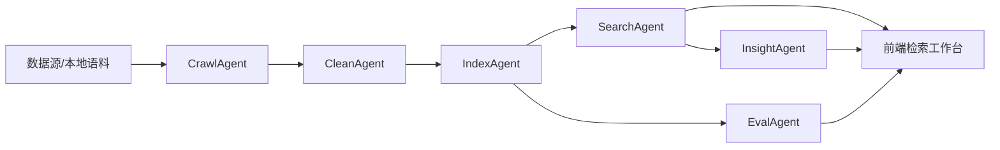

# KeyBoy 系统设计说明

## 1. 总体目标

KeyBoy 的目标是将课程设计从基础爬虫搜索升级为可演示、可解释、可评测、可扩展的专业领域智能搜索引擎。系统优先满足四个验收目标：

- 功能完整：采集、清洗、索引、搜索、摘要、评测闭环完整。
- 技术先进：使用混合检索、RRF、语义向量、二阶段重排。
- 工程可靠：零复杂依赖、本地可运行、接口清晰、测试可复现。
- 展示友好：前端同时展示结果、摘要、评分解释、Agent Trace 和指标。

## 2. 架构分层



## 3. 模块职责

| 模块 | 文件 | 职责 |
| --- | --- | --- |
| 数据模型 | `keyboy/models.py` | 文档、搜索结果、智能体跟踪、响应结构 |
| 文本处理 | `keyboy/text.py` | 中文/英文分词、领域词增强、语义特征、摘要句切分 |
| 混合索引 | `keyboy/index.py` | BM25、语义向量、RRF 融合、重排、解释 |
| 多智能体 | `keyboy/agents.py` | 采集、清洗、索引、搜索、摘要、评测流水线 |
| 合规爬虫 | `keyboy/crawler.py` | robots 检查、HTML 文本抽取、频率控制 |
| 摘要 | `keyboy/summarizer.py` | 基于 Top-K 结果的抽取式摘要 |
| 评测 | `keyboy/evaluator.py` | Recall@5、nDCG@5、平均耗时 |
| Web 服务 | `keyboy/app.py` | HTTP API 与静态前端托管 |
| 前端 | `web/` | 搜索工作台、模式切换、过滤、指标展示 |

## 4. 检索流程

1. 用户输入查询。
2. SearchAgent 生成查询画像：词项数、问题意图、技术词命中、BM25/语义权重。
3. BM25 通道执行关键词检索。
4. 语义通道执行哈希向量相似度检索。
5. Hybrid 模式下使用 RRF 将两个排序列表融合。
6. 二阶段重排加入标题覆盖、正文覆盖、新鲜度信号。
7. 返回 Top-K 结果、分数解释和命中关键词。
8. InsightAgent 生成抽取式智能摘要。

## 5. API 设计

### GET `/api/health`

返回系统状态、索引规模、来源、主题、评测指标。

### GET `/api/search`

参数：

| 参数 | 说明 |
| --- | --- |
| `q` | 查询文本 |
| `mode` | `hybrid`、`lexical`、`semantic` |
| `source` | 来源过滤，可为空 |
| `category` | 主题过滤，可为空 |
| `limit` | 返回数量 |

返回：

- `hits`：搜索结果。
- `summary`：智能摘要。
- `query_profile`：查询画像。
- `metrics`：响应时间、索引统计、评测指标。
- `traces`：智能体执行记录。

### GET `/api/metrics`

返回索引统计、离线评测结果和启动阶段 Agent Trace。

## 6. 数据结构

```json
{
  "title": "文档标题",
  "content": "正文",
  "url": "local://keyboy/example",
  "source": "来源",
  "published_at": "2026-05-09",
  "category": "主题",
  "tags": ["标签"]
}
```

## 7. 质量指标

| 指标 | 目标 | 当前实现 |
| --- | --- | --- |
| 响应时间 | 1000 篇内小于 3 秒 | 当前演示语料毫秒级 |
| Recall@5 | 不低于 0.70 | 自动计算 |
| nDCG@5 | 不低于 0.60 | 自动计算 |
| 可运行性 | 标准 Python 可运行 | 无外部强依赖 |
| 可解释性 | 每条结果可说明原因 | 输出四类分数和自然语言解释 |

## 8. 测试策略

运行：

```powershell
python -m unittest discover -s tests
```

测试覆盖：

- 索引是否成功构建。
- 混合检索是否能命中 RRF/BM25 相关资料。
- 语义查询是否能召回概念相关资料。
- 摘要是否非空。
- 评测指标是否达到课程设计阈值。

## 9. 验收优势

- 有真实可运行系统，不只是文档。
- 有现代搜索算法，不停留在 TF-IDF。
- 有指标和测试，可以证明质量。
- 有前端工作台，便于现场讲解。
- 有合规设计，规避爬虫风险。
- 有迭代说明，符合软件工程课程“过程可追踪”的要求。

