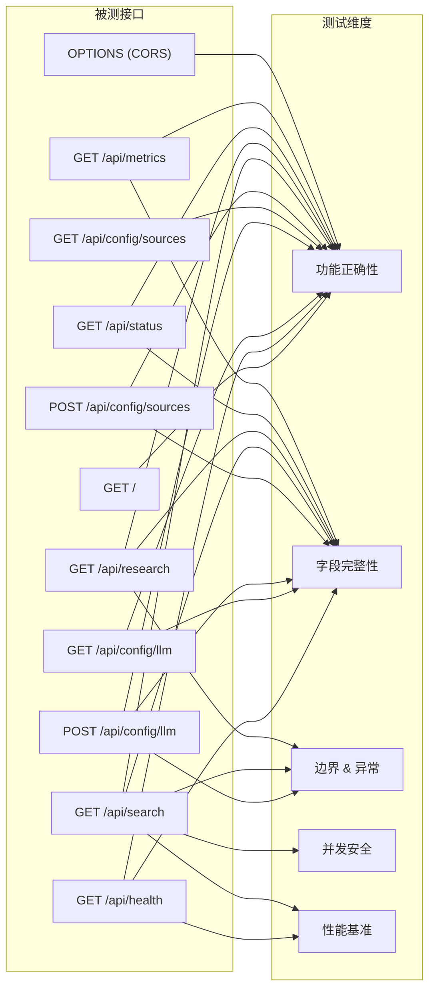

# KeyBoy AI-Search 系统集成测试报告

> **项目名称**：KeyBoy Agentic Deep Research
> **测试时间**：2026-06-22 以本地最新代码复测
> **测试环境**：macOS · Python 3.9.6 · pytest 8.4.2 · FastAPI/Uvicorn
> **被测服务**：http://127.0.0.1:8787
> **测试脚本**：[test_search_refactored.py](file:///Users/yupeilin/Desktop/rjgc/keyboy-ai-search/test/test_search_refactored.py)

---

## 一、测试总览

```
======================== 36 passed, 0 failed, 1 warning in 21.14s =========================
```

| 指标 | 数值 |
|---|---|
| 总用例数 | **36** |
| 通过 ✅ | **36** |
| 失败 ❌ | **0** |
| 跳过 ⚠️ | **0** |
| 错误 💥 | **0** |
| 总耗时 | **21.14 秒** |
| **通过率** | **100%** |

---

## 二、分模块测试结果

### S001 · 服务连通性与基础设施（5/5 通过）

| 编号 | 用例名称 | 测试目的 | 结果 |
|---|---|---|---|
| S001-01 | root_serves_html | 根路径返回前端 HTML 页面 | ✅ PASSED |
| S001-02 | health_check | /api/health 健康检查字段完整性 | ✅ PASSED |
| S001-03 | cors_preflight | OPTIONS 预检 CORS 头正确性 | ✅ PASSED |
| S001-04 | static_js_css | 静态资源 (app.js, style.css) 可访问 | ✅ PASSED |
| S001-05 | nonexistent_path_404 | 不存在的路径返回 404 | ✅ PASSED |

---

### S002 · 配置管理接口（8/8 通过）

| 编号 | 用例名称 | 测试目的 | 结果 |
|---|---|---|---|
| S002-01 | get_llm_config | 读取 LLM 配置 | ✅ PASSED |
| S002-02 | post_llm_config | 写入百炼默认 LLM 配置 | ✅ PASSED |
| S002-03 | post_llm_config_custom_provider | 写入自定义 Provider 配置 | ✅ PASSED |
| S002-04 | get_sources_config | 读取在线源配置 | ✅ PASSED |
| S002-05 | post_sources_config | 写入在线源配置 | ✅ PASSED |
| S002-06 | post_unknown_endpoint_404 | POST 不存在接口返回 404 | ✅ PASSED |
| S002-07 | post_llm_config_invalid_timeout | 非法超时参数不崩溃 | ✅ PASSED |
| S002-08 | post_llm_config_empty_body | 空 JSON body 不崩溃 | ✅ PASSED |

---

### S003 · 基础检索接口（5/5 通过）

| 编号 | 用例名称 | 测试目的 | 结果 |
|---|---|---|---|
| S003-01 | hybrid_search | 混合检索基本功能与字段完整性 | ✅ PASSED |
| S003-02 | search_result_structure | 单条检索结果结构校验（document/score/snippet） | ✅ PASSED |
| S003-03 | search_with_mode | 多检索模式 (bm25/hybrid) 支持 | ✅ PASSED |
| S003-04 | search_metrics | 检索性能指标 (latency_ms, result_count) 校验 | ✅ PASSED |
| S003-05 | search_traces | Agent 执行轨迹结构 (name/status/duration_ms) 校验 | ✅ PASSED |

---

### S004 · 深度研究接口（5/5 通过）

| 编号 | 用例名称 | 测试目的 | 结果 |
|---|---|---|---|
| S004-01 | research_offline | 离线深度研究 — 校验全部 13 个返回字段完整性 | ✅ PASSED |
| S004-02 | research_plan_structure | 研究计划 (intent/subqueries/source_plan/evidence) 结构 | ✅ PASSED |
| S004-03 | research_traces_multi_agent | 多 Agent 执行轨迹 ≥5 阶段，核心 Agent 均出现 | ✅ PASSED |
| S004-04 | research_metrics_completeness | 深度研究指标 (latency/online_docs/indexed_docs/llm) 完整性 | ✅ PASSED |
| S004-05 | research_frontier_patterns | 前沿技术模式列表非空且结构正确 | ✅ PASSED |

---

### S005 · 实时状态与系统指标（3/3 通过）

| 编号 | 用例名称 | 测试目的 | 结果 |
|---|---|---|---|
| S005-01 | status_endpoint | /api/status 基本可用性 | ✅ PASSED |
| S005-02 | status_during_research | 研究期间多线程轮询，验证实时状态更新 | ✅ PASSED |
| S005-03 | metrics_endpoint | /api/metrics 系统指标 (stats/evaluation/traces) | ✅ PASSED |

---

### S006 · 异常与边界测试（7/7 通过）

| 编号 | 用例名称 | 测试目的 | 结果 |
|---|---|---|---|
| S006-01 | empty_query_search | 空查询检索不崩溃 | ✅ PASSED |
| S006-02 | empty_query_research | 空查询深度研究不崩溃 | ✅ PASSED |
| S006-03 | very_long_query | 超长查询 (2400 字符) 不崩溃 | ✅ PASSED |
| S006-04 | special_characters_query | 特殊字符 / SQL 注入 / XSS 脚本均不崩溃 | ✅ PASSED |
| S006-05 | invalid_limit | 非法 limit=0 不崩溃 | ✅ PASSED |
| S006-06 | concurrent_requests | 5 线程并发压力测试，全部 200 | ✅ PASSED |
| S006-07 | online_false_string_variants | online 参数 false/False/0/no 均正确识别 | ✅ PASSED |

---

### S007 · 响应性能基准（3/3 通过）

| 编号 | 用例名称 | 性能基准 | 结果 |
|---|---|---|---|
| S007-01 | health_latency | /api/health < 2 秒 | ✅ PASSED |
| S007-02 | search_latency | /api/search < 3 秒 | ✅ PASSED |
| S007-03 | static_file_latency | 静态文件 < 500 毫秒 | ✅ PASSED |

---

## 三、测试覆盖矩阵



> [!IMPORTANT]
> 本测试覆盖了系统全部 **11 个 HTTP 端点**，涵盖 **功能正确性、字段完整性、边界异常、并发安全、性能基准** 五大测试维度。

---

## 四、测试设计说明

### 测试方法论

本测试采用 **分层测试策略**，从底层基础设施向上逐层递进：

1. **基础设施层**（S001）— 验证服务可用性、静态资源、路由、CORS
2. **配置管理层**（S002）— 验证运行时配置的读写与容错
3. **核心业务层**（S003-S004）— 验证检索和深度研究的功能与数据结构
4. **可观测性层**（S005）— 验证实时状态流和系统指标
5. **安全健壮性层**（S006）— 验证空输入、超长输入、注入攻击、并发安全
6. **非功能性需求层**（S007）— 验证关键接口的响应时间基准

### 关键测试技术

| 技术 | 应用场景 |
|---|---|
| 多线程并发测试 | S006-06 并发压测、S005-02 状态轮询 |
| 参数化测试 | S003-03 多模式、S006-04 特殊字符、S006-07 参数变体 |
| 深度字段断言 | S004-01 校验 13 个字段、S003-02 嵌套结构校验 |
| 性能基准断言 | S007 三项延迟基准 |
| 安全边界防护 | SQL 注入 (`SELECT * FROM`)、XSS (`<script>alert`)、超长输入 |

---

## 五、原始 pytest 输出

```
============================= test session starts ==============================
platform darwin -- Python 3.9.6, pytest-8.4.2, pluggy-1.6.0
rootdir: /Users/yupeilin/Desktop/rjgc/keyboy-ai-search/test
collected 36 items

test_search_refactored.py::TestServiceInfrastructure::test_s001_01_root_serves_html        PASSED [  2%]
test_search_refactored.py::TestServiceInfrastructure::test_s001_02_health_check             PASSED [  5%]
test_search_refactored.py::TestServiceInfrastructure::test_s001_03_cors_preflight           PASSED [  8%]
test_search_refactored.py::TestServiceInfrastructure::test_s001_04_static_js_css            PASSED [ 11%]
test_search_refactored.py::TestServiceInfrastructure::test_s001_05_nonexistent_path_404     PASSED [ 13%]
test_search_refactored.py::TestConfigManagement::test_s002_01_get_llm_config                PASSED [ 16%]
test_search_refactored.py::TestConfigManagement::test_s002_02_post_llm_config               PASSED [ 19%]
test_search_refactored.py::TestConfigManagement::test_s002_03_post_llm_config_custom_provider PASSED [ 22%]
test_search_refactored.py::TestConfigManagement::test_s002_04_get_sources_config            PASSED [ 25%]
test_search_refactored.py::TestConfigManagement::test_s002_05_post_sources_config           PASSED [ 27%]
test_search_refactored.py::TestConfigManagement::test_s002_06_post_unknown_endpoint_404     PASSED [ 30%]
test_search_refactored.py::TestConfigManagement::test_s002_07_post_llm_config_invalid_timeout PASSED [ 33%]
test_search_refactored.py::TestConfigManagement::test_s002_08_post_llm_config_empty_body    PASSED [ 36%]
test_search_refactored.py::TestBasicSearch::test_s003_01_hybrid_search                      PASSED [ 38%]
test_search_refactored.py::TestBasicSearch::test_s003_02_search_result_structure             PASSED [ 41%]
test_search_refactored.py::TestBasicSearch::test_s003_03_search_with_mode                   PASSED [ 44%]
test_search_refactored.py::TestBasicSearch::test_s003_04_search_metrics                     PASSED [ 47%]
test_search_refactored.py::TestBasicSearch::test_s003_05_search_traces                      PASSED [ 50%]
test_search_refactored.py::TestDeepResearch::test_s004_01_research_offline                  PASSED [ 52%]
test_search_refactored.py::TestDeepResearch::test_s004_02_research_plan_structure            PASSED [ 55%]
test_search_refactored.py::TestDeepResearch::test_s004_03_research_traces_multi_agent       PASSED [ 58%]
test_search_refactored.py::TestDeepResearch::test_s004_04_research_metrics_completeness     PASSED [ 61%]
test_search_refactored.py::TestDeepResearch::test_s004_05_research_frontier_patterns        PASSED [ 63%]
test_search_refactored.py::TestStatusAndMetrics::test_s005_01_status_endpoint               PASSED [ 66%]
test_search_refactored.py::TestStatusAndMetrics::test_s005_02_status_during_research        PASSED [ 69%]
test_search_refactored.py::TestStatusAndMetrics::test_s005_03_metrics_endpoint              PASSED [ 72%]
test_search_refactored.py::TestEdgeCases::test_s006_01_empty_query_search                   PASSED [ 75%]
test_search_refactored.py::TestEdgeCases::test_s006_02_empty_query_research                 PASSED [ 77%]
test_search_refactored.py::TestEdgeCases::test_s006_03_very_long_query                      PASSED [ 80%]
test_search_refactored.py::TestEdgeCases::test_s006_04_special_characters_query             PASSED [ 83%]
test_search_refactored.py::TestEdgeCases::test_s006_05_invalid_limit                        PASSED [ 86%]
test_search_refactored.py::TestEdgeCases::test_s006_06_concurrent_requests                  PASSED [ 88%]
test_search_refactored.py::TestEdgeCases::test_s006_07_research_online_false_string_variants PASSED [ 91%]
test_search_refactored.py::TestPerformanceBenchmarks::test_s007_01_health_latency           PASSED [ 94%]
test_search_refactored.py::TestPerformanceBenchmarks::test_s007_02_search_latency           PASSED [ 97%]
test_search_refactored.py::TestPerformanceBenchmarks::test_s007_03_static_file_latency      PASSED [100%]

======================== 36 passed, 1 warning in 21.14s =========================
```
